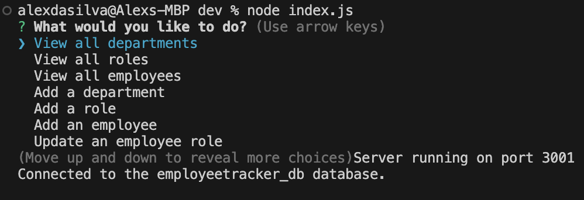

# Employee-Tracker

## Description

Employee Tracker is a command-line application that allows business owners to manage their company's employee database. Built with Node.js, Inquirer, PostgreSQL, and Express.js, this application enables users to view and manage departments, roles, and employees to organize and plan their business efficiently.

## Features

- View all departments
- View all roles
- View all employees
- Add a department
- Add a role
- Add an employee
- Update an employee's role

## Table of Contents

- [Installation](#installation)
- [Usage](#usage)
- [Database Schema](#database-schema)
- [Contributing](#contributing)
- [Questions](#questions)

## Installation

1. **Clone the Repository**

   ```sh
   git clone https://github.com/yourusername/employee-tracker.git
   cd employee-tracker
   ```

2. **Install Dependencies**

   ```sh
   npm install
   ```

3. **Set Up the Database**

- Install PostgreSQL if you haven't already.
  Follow the official PostgreSQL installation guide for your operating system: https://www.postgresql.org/download/.

- Connect to psql client.

  ```sh
  psql -U yourusername
  ```

- Run the schema.sql file to set up the database tables (Assuming your acessing the command-line terminal from the dev):
  ```psql
  postgres=# \i db/schema.sql
  ```

4. **Configure Environment Variable**

- Create a .env file in the root directory and add your database credentials:
  ```env
  DB_USER=yourusername
  DB_PASSWORD=yourpassword
  DB_HOST=localhost
  DB_DATABASE=employeetracker_db
  PORT=3001
  ```

5. **Seed the Database (Optional)**

- Populate the database with initial data (Assuming your acessing the command-line terminal from the dev folder):
  ```psql
  employeetracker_db=# \i db/seeds.sql
  ```

6. **Finish the psql client (optional)**
   ```sql
   employeetracker_db=# \q
   ```

## Usage

1. **Start the application**

   ```sh
   node index.js
   ```

2. **Follow the prompts**

   The application will present you with a menu of options. Choose an option to view departments, roles, employees, add new entries, or update existing entries.
   

3. **watch the video demo explaining the how to use it 👇👇👇**

https://drive.google.com/file/d/1mDSf221dsOCs4Km7A4gQ1ahN1DB80wCJ/view

## Database Schema

**departments**

```sql
id: SERIAL PRIMARY KEY
dep_title: VARCHAR(30) UNIQUE NOT NULL
```

**roles**

```sql
id: SERIAL PRIMARY KEY
role_title: VARCHAR(30) UNIQUE NOT NULL
department_id: INTEGER NOT NULL REFERENCES departments(id) ON DELETE SET NULL
salary: DECIMAL(10, 2) NOT NULL
```

**employees**

```sql
id: SERIAL PRIMARY KEY
first_name: VARCHAR(30) NOT NULL
last_name: VARCHAR(30) NOT NULL
role_id: INTEGER NOT NULL REFERENCES roles(id) ON DELETE SET NULL
department_id: INTEGER NOT NULL REFERENCES departments(id) ON DELETE SET NULL
role_salary: DECIMAL(10, 2) NOT NULL
manager_id: INTEGER REFERENCES employees(id) ON DELETE SET NULL
```

**managers**

```sql
id: SERIAL PRIMARY KEY
full_name: VARCHAR(60) NOT NULL
```

## Credits and Stack

- Node.Js (https://nodejs.org/en)
- PostgreSQL (https://www.postgresql.org/download/)
- Express.js (https://expressjs.com/)
- Inquirer (https://www.npmjs.com/package/inquirer)

## How to Contribute and Questions

Contributions are welcome!
If you want to contribute or have any questions, here are my channels:
gitHub: https://github.com/Alex-Design-For-Reap/Employee-Tracker

email: s.alexsilva@gmail.com

Author: Alex Da Silva (https://alex-design-for-reap.github.io/Portfolio/)
